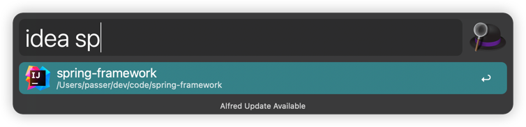
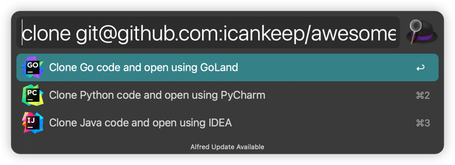

# awesome-alfred
## Introduce
An Alfred workflow efficiency tool that provides quick opening of JetBrains product projects, 
as well as some capabilities such as text conversion and formatting that will soon arrive.

## Quick start

1. Download and install Alfred workflow
For more help, please refer to the [official documentation](https://www.alfredapp.com/help/getting-started/)

2. Download and import the [workflow](https://github.com/icankeep/awesome_alfred/releases)

3. Enjoy your workflow

## Example
1. Quick open project with the products of JetBrains
- gl

- charm

- idea

2. Quick clone and open project with the products of JetBrains
- clone

3. Coming soon...

## TODO
- [ ] convert everything
- [ ] timestamp

## Contribute

Welcome to report any issues.

## License
[Apache License](https://github.com/icankeep/awesome_alfred/blob/main/LICENSE)